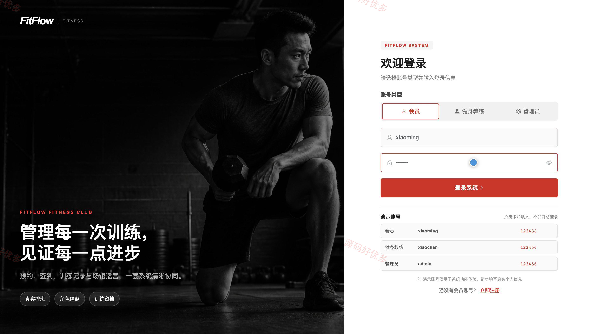
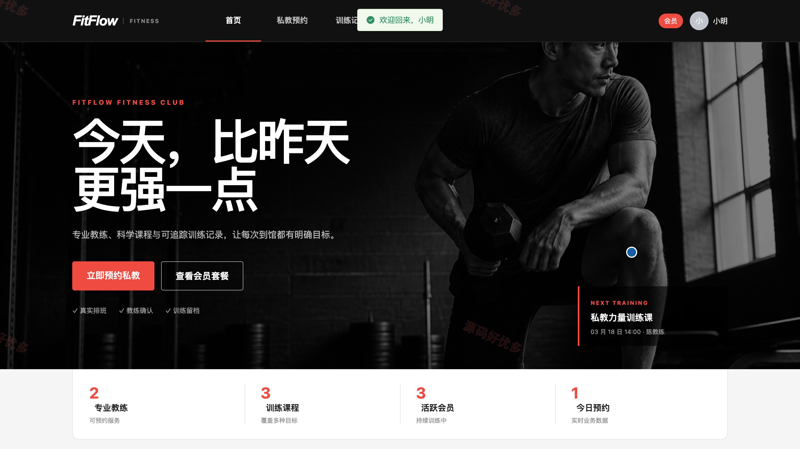
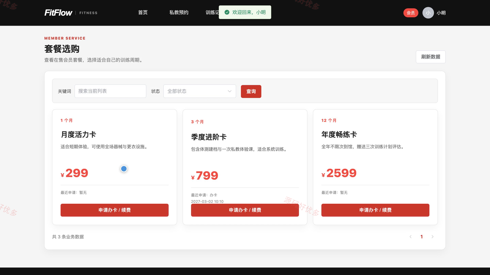
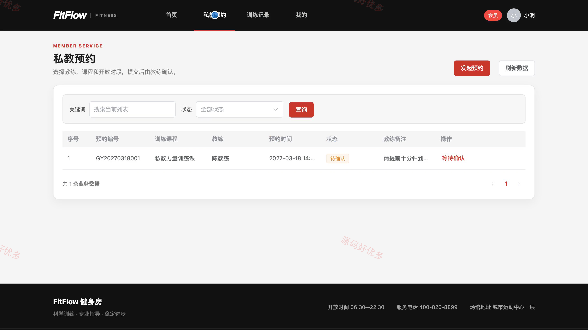
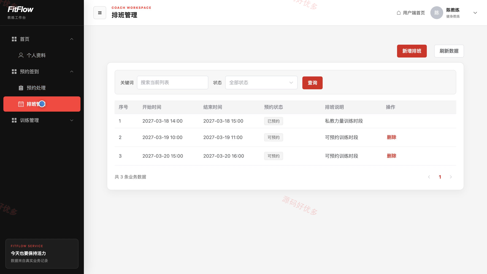
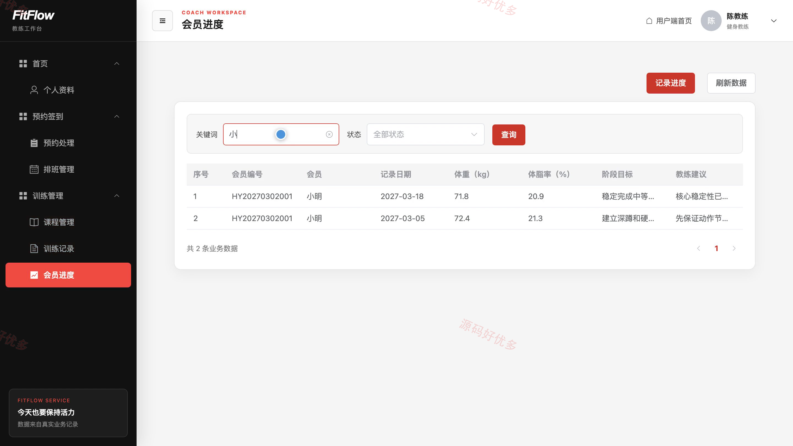
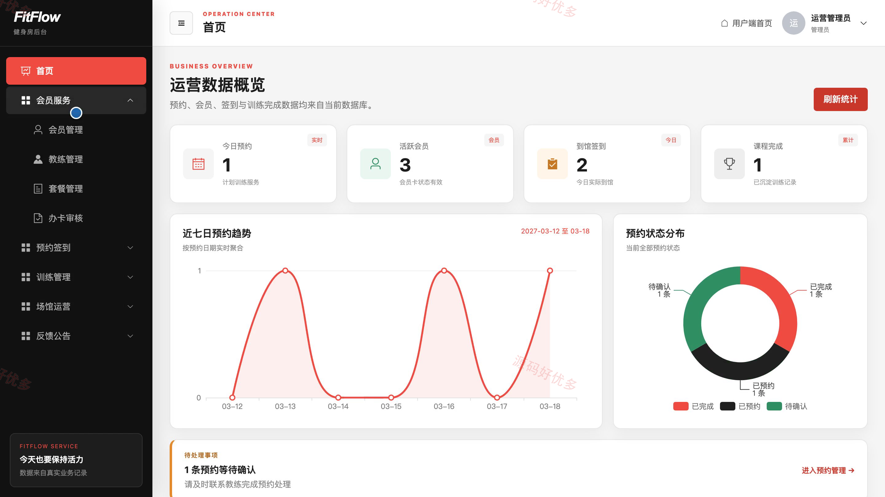
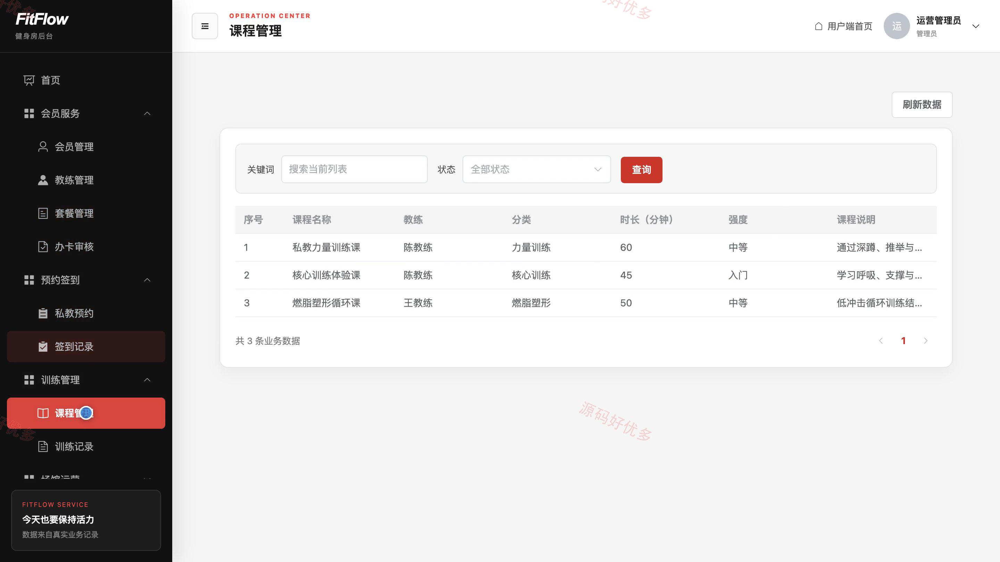

# bs040A
bs040A健身房管理系统
## 源码问题查看主页咨询

### 一、关键词
健身房管理、会员健身、私教预约、运动场馆、训练打卡

### 二、作品包含
源码+数据库+全套环境和工具资源+本地部署教程

### 三、项目技术
前端技术： Html、Css、Js、Vue3.4、Element-Plus
后端技术：Java、SpringBoot3.2.0、MyBatis-Plus

### 四、运行环境（以下版本亲测，其他版本兼容性请自行测试）
开发工具：IDEA/eclipse + VSCODE

数据库：MySQL5.7+（共13张表）

数据库管理工具：Navicat10以上版本

环境配置软件： JDK17 + Maven

前端Nodejs：16+

浏览器：谷歌浏览器

### 五、项目介绍
项目编号：bs040A

健身房管理系统面向会员、健身教练和管理员，围绕会员套餐与办卡续费、私教排班与预约、到馆签到、训练记录、健身进度、场馆器材和运营反馈完成业务协同。

角色：会员、健身教练、管理员

会员功能：会员套餐查看、办卡续费申请、私教预约、到馆签到、训练记录查看、意见反馈、会员资料管理。

健身教练功能：个人资料维护、排班管理、预约处理、课程管理、训练记录管理、会员训练进度管理。

管理员功能：运营数据看板、会员与教练管理、套餐与办卡审核、私教预约与签到管理、课程与训练记录管理、场馆与器材管理、意见反馈与公告管理、个人中心。

### 六、运行截图

